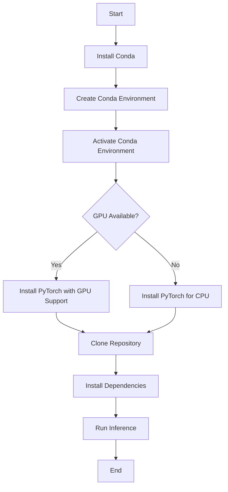

# CCTV Footage Detection

This repository contains code for CCTV footage detection using PyTorch.

## Installation and Running Instructions

Choose the appropriate method based on your operating system and preferred environment:

### Windows

#### 1. Using Conda Environment



a. Make sure Conda is installed on your system.

b. Create a Conda environment:

```bash
conda create --name virtualenv
```

c. Activate the Conda environment:

- Option 1: In the command palette, select Python: Select Interpreter -> select virtualenv conda environment
- Option 2: In the terminal:
  ```bash
  conda activate virtualenv
  ```

d. Install PyTorch:

- For CPU:
  ```bash
  conda install pytorch torchvision cpuonly -c pytorch
  ```
- For GPU:
  ```bash
  conda install pytorch torchvision torchaudio pytorch-cuda=12.4 -c pytorch -c nvidia
  ```

e. Clone the repository:

```bash
git clone https://github.com/ByteMeEthos/CCTV_footage_detection.git
```

f. Change to the project directory:

```bash
cd CCTV_footage_detection
```

g. Install dependencies:

```bash
pip install -r requirements.txt
```

h. Change to the inference folder:

```bash
cd inference
```

i. Run the inference:

```bash
python run_inference.py
```

j. View the model results in the `data -> output` directory.

#### 2. Using Python Virtual Environment

a. Create a virtual environment:

```bash
python -m venv virtualenv
```

b. Activate the virtual environment:

```bash
.\virtualenv\Scripts\activate
```

c. Follow steps e-j from the Conda instructions above.

### Linux

#### 1. Using Conda Environment

a. Install Conda if not already installed.

b. Create a Conda environment:

```bash
conda create --name virtualenv
```

c. Activate the Conda environment:

```bash
conda activate virtualenv
```

d. Install PyTorch:

- For CPU:
  ```bash
  conda install pytorch torchvision cpuonly -c pytorch
  ```
- For GPU:
  ```bash
  conda install pytorch torchvision torchaudio pytorch-cuda=12.4 -c pytorch -c nvidia
  ```

e. Clone the repository:

```bash
git clone https://github.com/ByteMeEthos/CCTV_footage_detection.git
```

f. Change to the project directory:

```bash
cd CCTV_footage_detection
```

g. Install dependencies:

```bash
pip install -r requirements.txt
```

h. Change to the inference folder:

```bash
cd inference
```

i. Run the inference:

```bash
python run_inference.py
```

j. View the model results in the `data -> output` directory.

#### 2. Using Python Virtual Environment

a. Create a virtual environment:

```bash
python3 -m venv virtualenv
```

b. Activate the virtual environment:

```bash
source virtualenv/bin/activate
```

c. Follow steps e-j from the Conda instructions above.

### macOS

#### 1. Using Conda Environment

a. Install Conda if not already installed.

b. Create a Conda environment:

```bash
conda create --name virtualenv
```

c. Activate the Conda environment:

```bash
conda activate virtualenv
```

d. Install PyTorch:

- For CPU:
  ```bash
  conda install pytorch torchvision -c pytorch
  ```
- For GPU (M1/M2 Macs):
  ```bash
  conda install pytorch torchvision -c pytorch
  ```

e. Clone the repository:

```bash
git clone https://github.com/ByteMeEthos/CCTV_footage_detection.git
```

f. Change to the project directory:

```bash
cd CCTV_footage_detection
```

g. Install dependencies:

```bash
pip install -r requirements.txt
```

h. Change to the inference folder:

```bash
cd inference
```

i. Run the inference:

```bash
python run_inference.py
```

j. View the model results in the `data -> output` directory.

#### 2. Using Python Virtual Environment

a. Create a virtual environment:

```bash
python3 -m venv virtualenv
```

b. Activate the virtual environment:

```bash
source virtualenv/bin/activate
```

c. Follow steps e-j from the Conda instructions above.

## Additional Information

For more details on the project, please refer to the documentation or contact the repository maintainers.
